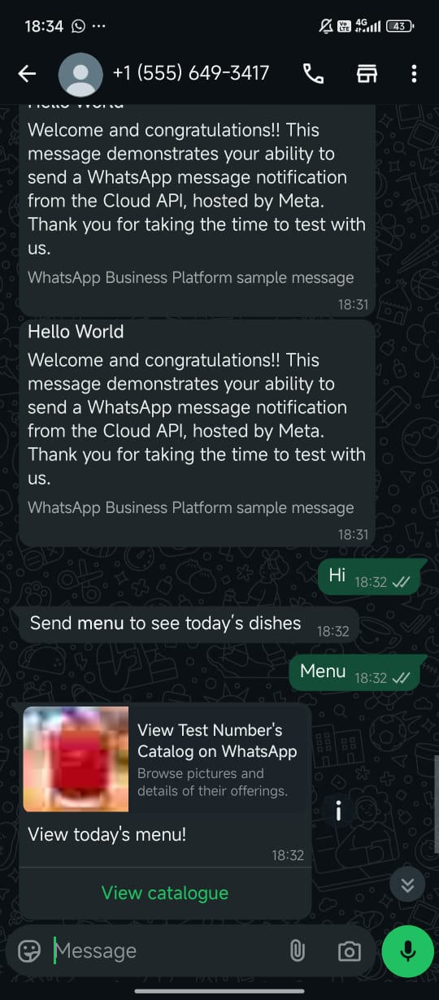
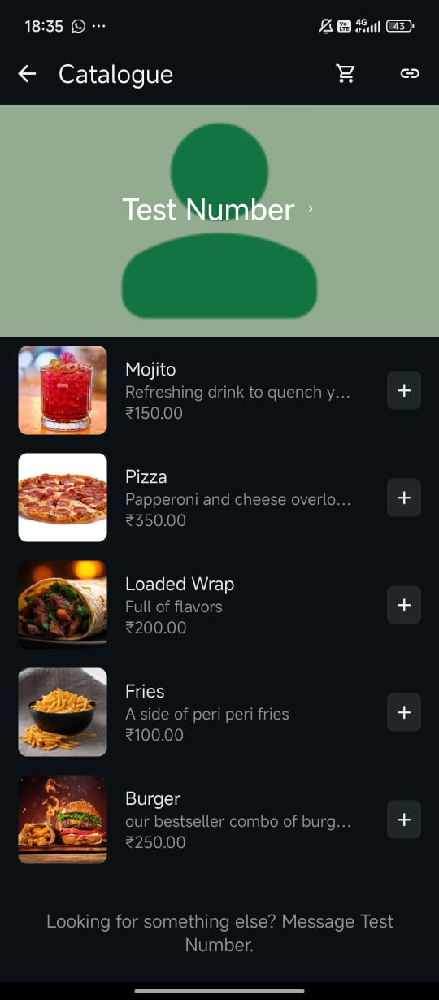
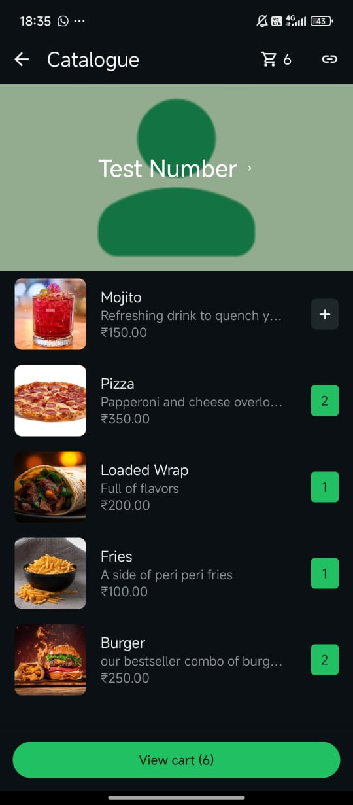
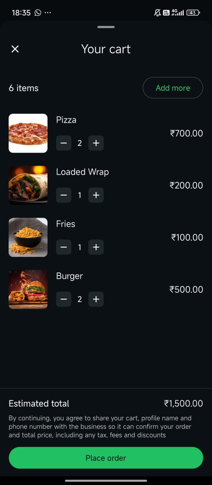
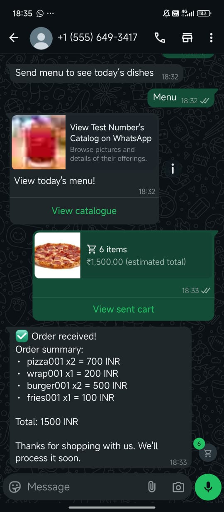
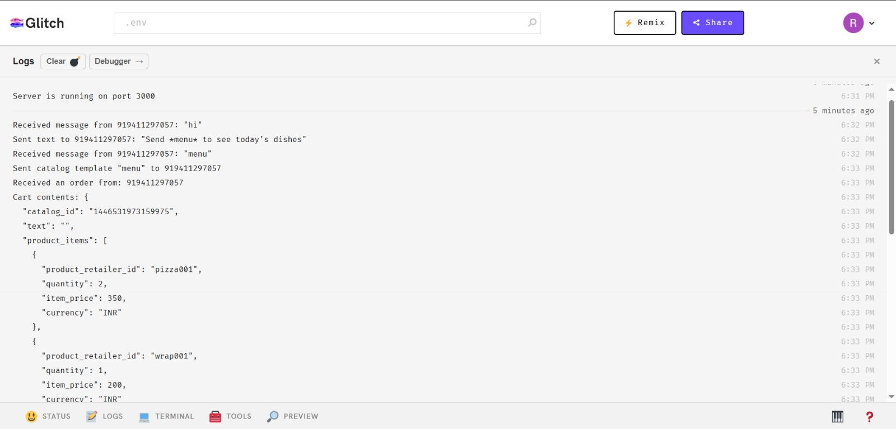
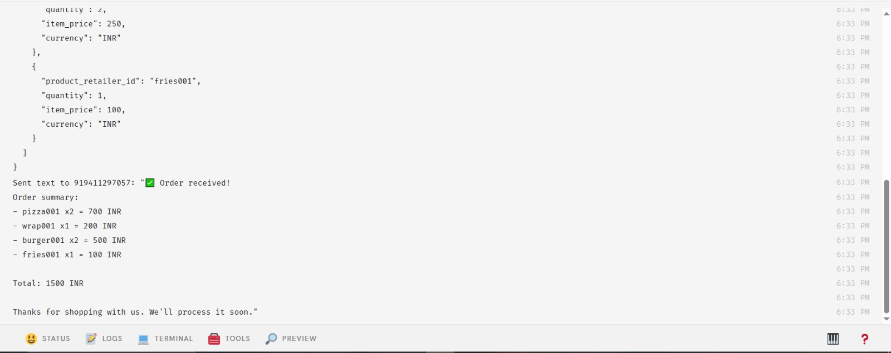

# WhatsApp Catalog Ordering Bot  
A Node.js + Express backend using the WhatsApp Cloud API. This server listens for incoming WhatsApp messages, sends a product catalog, receives customer orders via WhatsApp cart, and responds with an itemized order summary and total amount.


## Features

- Sends catalog template when user types `menu`
- Accepts WhatsApp cart-based orders
- Calculates total cost and sends receipt message
- Handles fallback responses for invalid input

##  Built With
- Node.js

- Express.js

- WhatsApp Cloud API

- ngrok

- dotenv

- axios


## WhatsApp Interaction Flow

1. User sends the word `menu`
2. Bot replies with catalog template
3. User adds items to cart and places order
4. Bot receives order message and responds with:
   - Order summary
   - Item list with quantities and prices
   - Total amount

All other inputs will trigger a fallback message suggesting the user to type `menu`.

---
## Screenshots

### User Interaction

**Catalog request:**



**Catalog display:**  


**Items added to cart:** 




**View Cart:**  



**Order summary received (receipt):**



### Server Logs




## Demo

a working demo video is available here:

[Drive Demo Folder](https://drive.google.com/file/d/1HSrMv29TynGltWaJnkevRRDSRiKX5Xb2/view?usp=sharing)


---

## 🧑‍💻 How to Run Locally

### 1. Prerequisites
- Node.js installed
- WhatsApp Cloud API setup with Meta Developer Account
- A verified WhatsApp Business Number and Meta App
- `ngrok` installed for tunneling the webhook (if running locally)

### 2. Clone the Repository
```bash
git clone https://github.com/<your-username>/whatsapp-catalog-bot.git
cd whatsapp-catalog-bot
```

### 3. Install Dependencies

```bash
npm install
```

### 4. Configure .env

Create a .env file in the root folder:

```ini
WEBHOOK_VERIFY_TOKEN=your_verify_token  
GRAPH_API_TOKEN=your_generated_token  
PHONE_NUMBER_ID=your_whatsapp_phone_number_id  
PORT=3000  
CATALOG_TEMPLATE_NAME=menu  
```

### 5. Start the Server

```bash
ngrok http 3000

```

### 6. Expose to Internet (in another terminal)
```bash
ngrok http 3000

```
Copy the https:// URL and paste it into your Webhook URL in Meta Developer Portal.


##  Future Improvements

- Store received orders in a cloud database like Supabase or MongoDB

- Generate a downloadable invoice PDF

- Add admin panel for order tracking

- Enable payment gateway integration

- Add customer session management

- Integrate multi-language catalog support

## Author

Made with attention to detail and understanding of WhatsApp Cloud APIs by **Rakshit Bansal**
Feel free to reach out for questions or collaboration ideas!


